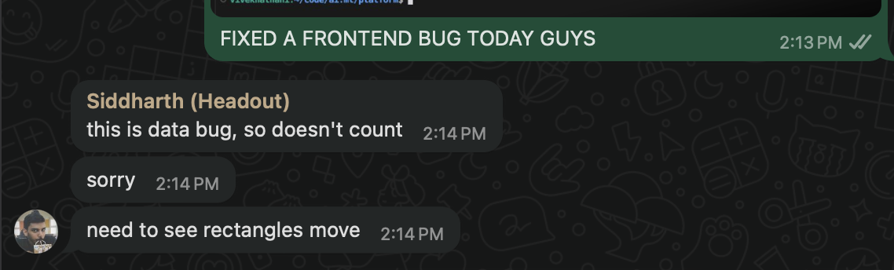

# tools

A react app to host a bunch of tools related to math.

## origin story

I was celebrating the fact that I am finally a fullstack engineer, equipped with the godly knowledge of React.

[Sid](https://x.com/clearlysid) could not believe it.


<br/>


Hence, I built this thing to prove a point.

Matter of pride, I guess.

## how to run

```bash
yarn
yarn dev
```

## license

[MIT](./LICENSE)

